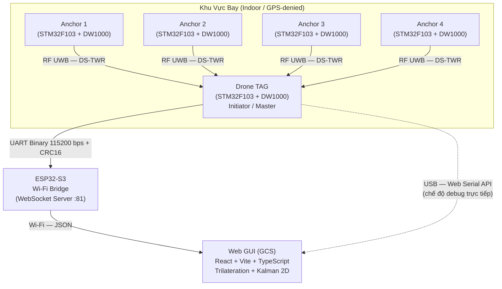

# 📡 UWB For Drone

> **Hệ thống định vị không gian thời gian thực, độ chính xác centimet, dành cho Drone & Robot di động trong môi trường không có GPS.**

Dự án triển khai một giải pháp **Indoor Positioning System (IPS)** hoàn chỉnh từ phần cứng nhúng tới giao diện giám sát mặt đất, sử dụng công nghệ sóng vô tuyến siêu băng rộng **Ultra-Wideband (UWB)** với chip Decawave **DW1000**. Hệ thống đạt sai số định vị **±10–20 cm** ở tần số cập nhật **30–50 Hz** và hoạt động ổn định trong nhà cũng như khu vực mất/nhiễu GPS.

---

## 🗂️ Mục Lục

- [Tính Năng Nổi Bật](#-tính-năng-nổi-bật)
- [Kiến Trúc Hệ Thống](#-kiến-trúc-hệ-thống)
- [Phần Cứng Yêu Cầu](#-phần-cứng-yêu-cầu)
- [Cấu Trúc Thư Mục](#-cấu-trúc-thư-mục)
- [Hướng Dẫn Cài Đặt](#-hướng-dẫn-cài-đặt)
  - [1. Hiệu Chuẩn Hệ Thống](#1-hiệu-chuẩn-hệ-thống-calibration)
  - [2. Biên Dịch & Nạp Firmware STM32](#2-biên-dịch--nạp-firmware-stm32)
  - [3. Nạp Firmware ESP32-S3](#3-nạp-firmware-esp32-s3)
  - [4. Chạy Web GUI](#4-chạy-web-gui)
- [Giao Thức Truyền Thông](#-giao-thức-truyền-thông-binary-telemetry)
- [Thuật Toán Lọc Khoảng Cách](#-thuật-toán-lọc-khoảng-cách)
- [Thông Số Kỹ Thuật](#-thông-số-kỹ-thuật)
- [Cấu Hình Nâng Cao](#-cấu-hình-nâng-cao)
- [Hướng Phát Triển Tiếp Theo](#-hướng-phát-triển-tiếp-theo)

---

## ✨ Tính Năng Nổi Bật

| Tính năng | Chi tiết |
|---|---|
| **Giao thức đo DS-TWR** | Double-Sided Two-Way Ranging 4 Anchor, loại trừ sai số trôi xung nhịp (clock drift) mà không cần dây đồng bộ phần cứng |
| **Bộ lọc thích nghi chuyển động** | Tự động phân biệt 4 trạng thái bay (STATIC / SLOW / FAST / SETTLING) và điều chỉnh hệ số Kalman Q tương ứng |
| **Bù sai số FPP** | Hiệu chỉnh phi tuyến theo công suất xung đầu (First Path Power) do ảnh hưởng của phản xạ đa đường (multipath) |
| **Giao thức nhị phân CRC16** | Gói tin binary tối ưu băng thông UART, kiểm tra toàn vẹn bằng CRC16-CCITT (poly 0x1021, init 0xFFFF) |
| **Kết nối kép USB / Wi-Fi** | GUI kết nối trực tiếp với STM32 TAG qua Web Serial API hoặc qua ESP32-S3 WebSocket Bridge |
| **Trilateration + Kalman 2D** | Giải tọa độ bằng phương pháp đa cầu Multilateration, làm mịn quỹ đạo bằng bộ lọc Kalman 2D |
| **Replay Harness** | Ghi nhận và phát lại toàn bộ dữ liệu bay offline để kiểm thử, so sánh thuật toán |
| **Calibration Wizard** | Trình hiệu chuẩn trực quan ngay trong GUI, xuất CSV, tự động tính Antenna Delay |

---

## 🏗️ Kiến Trúc Hệ Thống



**Hai chế độ kết nối với GUI:**
- **Wi-Fi Mode**: TAG → UART → ESP32-S3 → WebSocket (Port 81) → GUI. Dùng trong vận hành thực tế.
- **USB Mode**: TAG → USB (Web Serial API) → GUI trực tiếp. Dùng khi debug không có ESP32-S3.

---

## 🔩 Phần Cứng Yêu Cầu

| Linh kiện | Số lượng | Mô tả |
|---|---|---|
| **STM32F103C8T6** ("Blue Pill") | 6 | 5 cho Anchor (4) + TAG (1) + Test hardware (1) |
| **Decawave DW1000** (module) | 5 | Chip thu phát UWB, kết nối SPI với STM32 |
| **ESP32-S3** (DevKit) | 1 | Cầu nối UART → Wi-Fi WebSocket |
| **ST-Link V2** | 1 | Mạch nạp/debug cho STM32 |
| **Dây UART** | — | Nối STM32 TAG `PA9 (TX)` với ESP32-S3 `GPIO1 (RX)` |
| **Nguồn 3.3V** | — | Cho STM32 + DW1000 (~150 mA mỗi node) |

### Kết Nối Phần Cứng

```
STM32 TAG (PA9 TX)  ──────────────────► ESP32-S3 (GPIO1 RX)  [UART 115200 bps]
STM32 TAG (PA10 RX) ◄─────────────── ESP32-S3 (GPIO2 TX)  [Dự phòng CMD]

STM32 ↔ DW1000:
  SPI1 → PA5 (SCK), PA6 (MISO), PA7 (MOSI), PA4 (NSS/CS)
  IRQ  → PB0
  RST  → PB1
```

---

## 📁 Cấu Trúc Thư Mục

```
UWB For Drone/
│
├── DW1000_decadriver/              # Thư viện driver Decawave DW1000
│   ├── DW1000_baremetal_lib/       #   Driver baremetal (dùng trong STM32_UWB)
│   │   ├── inc/                    #     Thanh ghi, deca_device.h, deca_regs.h
│   │   └── src/                    #     deca_device.c — driver chính DW1000
│   └── DW1000_freeRTOS_Lib/        #   Driver FreeRTOS + CIR analysis (NLOS detect)
│
├── ESP32S3_TAG/                    # Firmware ESP32-S3 Wireless Bridge
│   └── TAG/
│       ├── TAG.ino                 #   Entry point: setup Wi-Fi, vòng UART → WS
│       ├── uart_protocol.cpp/.h    #   FSM giải mã Binary Packet + CRC16-CCITT
│       ├── ws_bridge.cpp/.h        #   Chuyển packet nhị phân → JSON WebSocket
│       └── wifi_manager.cpp/.h     #   Non-blocking Wi-Fi reconnect (không dùng delay)
│
├── GUI test/                       # Web Ground Control Station (GCS)
│   ├── src/
│   │   ├── App.tsx                 #   Root app: tab routing + kết nối Wi-Fi/USB
│   │   ├── components/
│   │   │   ├── PositionMap.tsx     #   Bản đồ Canvas 2D vẽ Anchor + vệt bay Drone
│   │   │   ├── CalibrationWizard.tsx # Trình hiệu chuẩn Antenna Delay tự động
│   │   │   ├── FilterTuningLab.tsx #   Điều chỉnh thông số bộ lọc trực tuyến
│   │   │   ├── SystemHealthTab.tsx #   Giám sát sức khỏe link RF & transport
│   │   │   └── AnchorLayoutForm.tsx#   Nhập tọa độ 4 Anchor
│   │   ├── hooks/
│   │   │   ├── useUwbTelemetry.ts  #   Kết nối WebSocket, parse JSON range/stats
│   │   │   ├── usePositionEstimate.ts # Pipeline Trilateration + Kalman 2D
│   │   │   └── useWebSerial.ts     #   Kết nối USB trực tiếp qua Web Serial API
│   │   └── lib/
│   │       ├── trilateration.ts    #   Giải tọa độ Multilateration (Least Squares)
│   │       ├── kalman2d.ts         #   Bộ lọc Kalman 2D dự đoán vị trí
│   │       ├── telemetryBinary.ts  #   Parse Binary Packet từ USB Serial
│   │       ├── replayLog.ts        #   Ghi dữ liệu bay ra file
│   │       ├── replayRunner.ts     #   Phát lại dữ liệu bay offline
│   │       ├── fppBiasAnalysis.ts  #   Phân tích quan hệ FPP ↔ sai số khoảng cách
│   │       └── staticCalibrationAnalysis.ts # Tính Antenna Delay từ log tĩnh
│   ├── package.json                # Dependencies: React 18, Vite, TypeScript, Recharts
│   └── vite.config.ts
│
├── STM32_UWB/                      # Firmware C - STM32CubeIDE Projects
│   ├── Anchor/                     # Anchor 1 (Responder/Listener)
│   ├── Anchor_2/                   # Anchor 2
│   ├── Anchor_3/                   # Anchor 3
│   ├── Anchor_4/                   # Anchor 4
│   ├── TAG/                        # TAG chính (Initiator / DS-TWR Master)
│   │   └── Core/
│   │       ├── Inc/
│   │       │   ├── tag_ranging.h            # API chu kỳ đo, struct kết quả
│   │       │   ├── uwb_calibration.h        # Mọi hằng số hiệu chuẩn & cấu hình
│   │       │   ├── motion_adaptive_range.h  # Bộ lọc thích nghi C9.2 (header-only FSM)
│   │       │   ├── legacy_adaptive_tracking.h # Bộ lọc thích nghi C9.1
│   │       │   ├── range_filter.h           # Kalman scalar per-anchor
│   │       │   └── telemetry.h              # Định nghĩa Binary Packet Protocol
│   │       └── Src/
│   │           ├── tag_ranging.c            # Điều phối chu kỳ DS-TWR 4-Anchor
│   │           ├── motion_adaptive_range.c  # State machine STATIC→SLOW→FAST
│   │           ├── telemetry.c              # Đóng gói & phát gói tin qua UART
│   │           └── uart_tx.c               # Non-blocking ring buffer UART TX
│   ├── HostTests/                  # Unit test thuật toán chạy trên PC (không cần phần cứng)
│   └── Test_hardware/              # Project kiểm tra SPI/DW1000 khi bring-up lần đầu
│
├── tools/                          # Scripts Python hỗ trợ hiệu chuẩn
│   ├── calibration_from_log.py     # Tính Antenna Delay từ UART log
│   ├── calibration_from_wizard_csv.py # Tính từ CSV xuất bởi GUI Calibration Wizard
│   └── analyze_fpp_bias.py         # Vẽ đường cong FPP Bias (Power vs Distance error)
│
├── start_gui.bat                   # Phím tắt chạy GUI cho Windows (tự npm install)
├── PROJECT_OVERVIEW.md             # Tài liệu kiến trúc kỹ thuật chi tiết
├── README.md                       # File này
└── .gitignore
```

---

## 🚀 Hướng Dẫn Cài Đặt

### 1. Hiệu Chuẩn Hệ Thống (Calibration)

> **Đây là bước quan trọng nhất.** Mỗi mạch DW1000 có sai lệch trễ ăng-ten (Antenna Delay) riêng do dung sai sản xuất. Bỏ qua bước này khiến sai số khoảng cách lên tới 30–50 cm.

**Bước 1.1 – Đo ở khoảng cách chuẩn:**
- Đặt TAG cách một Anchor đúng **1.000 m** trên mặt phẳng, không có vật cản (LOS).
- Bật firmware, chờ ~2000 mẫu đo (~40 giây ở 50 Hz).
- Xuất log UART ra CSV, hoặc dùng GUI Calibration Wizard.

**Bước 1.2 – Tính Antenna Delay:**
```bash
cd tools
# Từ UART log:
python calibration_from_log.py --log anchor1_1m.csv --true-dist 1.0

# Từ CSV xuất bởi GUI Calibration Wizard:
python calibration_from_wizard_csv.py --csv wizard_export.csv
```

**Bước 1.3 – Cập nhật vào firmware** (`STM32_UWB/TAG/Core/Inc/uwb_calibration.h`):
```c
// Trễ ăng-ten (đơn vị DWT time unit, ~15.65 ps/unit)
#define UWB_TX_ANT_DLY   16436   // ← thay bằng giá trị tính được
#define UWB_RX_ANT_DLY   16436

// DS-TWR calibration offset per Anchor
#define UWB_DS_OFFSET_A1_M   154.091571
#define UWB_DS_OFFSET_A2_M   154.243357
#define UWB_DS_OFFSET_A3_M   154.235083
#define UWB_DS_OFFSET_A4_M   154.186475
```

---

### 2. Biên Dịch & Nạp Firmware STM32

**Yêu cầu:** [STM32CubeIDE](https://www.st.com/en/development-tools/stm32cubeide.html) ≥ 1.13

```
1. Mở STM32CubeIDE
2. File → Import → General → Existing Projects into Workspace
3. Trỏ tới thư mục "STM32_UWB", tick chọn tất cả projects
4. Build (Ctrl+B) → Nạp qua ST-Link (Run → Debug / Flash)
```

**Thứ tự nạp đề xuất:**
1. `Test_hardware` → Xác nhận DW1000 giao tiếp SPI đúng (lần bring-up đầu)
2. `Anchor`, `Anchor_2`, `Anchor_3`, `Anchor_4` → 4 mạch Anchor
3. `TAG` → Mạch trên Drone

> **Chế độ telemetry:** Mặc định firmware TAG xuất binary. Để debug qua Serial Monitor mà không có ESP32, tạm thời đặt `#define TELEM_ASCII 1` trong `telemetry.h`. Nhớ đặt lại về `0` trước khi dùng với ESP32.

---

### 3. Nạp Firmware ESP32-S3

**Yêu cầu:** [Arduino IDE](https://www.arduino.cc/en/software) ≥ 2.0 + Board Package `esp32 by Espressif`

**Cài thư viện (Arduino Library Manager):**
- `ArduinoJson` by Benoit Blanchon (≥ 7.x)
- `WebSockets` by Markus Sattler

**Cấu hình trước khi nạp** – mở `ESP32S3_TAG/TAG/TAG.ino`:
```cpp
// Dòng 39–40: Điền thông tin Wi-Fi
static const char* WIFI_SSID     = "YOUR_WIFI_SSID";
static const char* WIFI_PASSWORD = "YOUR_WIFI_PASSWORD";

// Dòng 44–45: Kiểm tra chân UART
#define RXD1  1   // ESP32 RX ← STM32 TX (PA9)
#define TXD1  2   // ESP32 TX → STM32 RX (dự phòng CMD)
```

Sau khi nạp, mở Serial Monitor Arduino (115200 bps) để xem IP được cấp phát cho ESP32-S3. Ghi lại IP này để nhập vào GUI.

---

### 4. Chạy Web GUI

**Yêu cầu:** [Node.js](https://nodejs.org/) ≥ 18 LTS

**Cách nhanh (Windows):** Nhấp đúp file `start_gui.bat`
*(Script tự kiểm tra `node_modules`, chạy `npm install` nếu thiếu, rồi khởi động Vite dev server.)*

**Cách thủ công (terminal):**
```bash
cd "GUI test"
npm install        # Lần đầu tiên
npm run dev        # Khởi động
# → Mở trình duyệt tại http://localhost:5173
```

**Kết nối với hệ thống:**

| Chế độ | Cách thực hiện |
|---|---|
| **Wi-Fi** | Click "Connect" → nhập IP ESP32-S3 → "Connect Wi-Fi" |
| **USB Direct** | Cắm cáp USB vào STM32 TAG → Click "Connect USB" (Chrome/Edge ≥ 89) |

**Thiết lập tọa độ Anchor:**

Vào tab **"Setup"** → nhập tọa độ X, Y (mét) theo bố cục thực tế. Ví dụ bố cục 5×4 m:
```
A1: (0.0, 0.0)    A2: (5.0, 0.0)
A3: (2.5, 4.0)    A4: (5.0, 4.0)
```

---

## 📦 Giao Thức Truyền Thông (Binary Telemetry)

STM32 TAG phát gói tin nhị phân tối ưu hóa qua UART 115200 bps:

```
┌──────────┬──────┬───────┬───────┬──────────┬─────────────┬──────────────┬────────┐
│  SOF[2]  │ VER  │ TYPE  │ LEN   │  SEQ[4]  │ TIME_MS[4]  │ PAYLOAD[N]   │ CRC[2] │
│ 0xAA,55  │ 0x01 │ 0–3   │ LE16  │  LE32    │   LE32      │  N bytes     │ LE16   │
└──────────┴──────┴───────┴───────┴──────────┴─────────────┴──────────────┴────────┘
 Multi-byte fields: Little-Endian
 CRC16-CCITT-FALSE (Poly 0x1021, Init 0xFFFF) tính từ VER đến hết PAYLOAD
```

**Các loại gói tin (TYPE):**

| TYPE | Tên | Tần suất | Nội dung |
|---|---|---|---|
| `0x00` | **INFO** | ~1 Hz + boot | Profile hiệu chuẩn, ranging mode, firmware flags, trạng thái adaptive filter |
| `0x01` | **RANGE** | ~50 Hz | Per-anchor: raw_mm, filtered_mm, fpp_cdbm, valid, status, age_ms |
| `0x02` | **STATS** | ~1 Hz | Counters: poll_sent, response_ok, rx_timeout, rx_error, cyc_hz, ops_hz |
| `0x03` | **POSITION** | Phase 5 | Tọa độ XY/XYZ từ onboard EKF (chưa triển khai) |

ESP32-S3 giải mã FSM và phát broadcast JSON lên WebSocket Port 81:
```json
{
  "type": "range",
  "seq": 12345,
  "time": 60231,
  "anchors": [
    {"id": 1, "valid": true, "rawMm": 1523, "filtMm": 1518, "fppDbm": -81.2},
    {"id": 2, "valid": true, "rawMm": 3041, "filtMm": 3038, "fppDbm": -84.7}
  ]
}
```

---

## 🧮 Thuật Toán Lọc Khoảng Cách

Pipeline lọc nhiều lớp trên STM32 TAG, áp dụng độc lập cho từng Anchor:

```
[Đo DS-TWR thô]
      │
      ▼
[1. Bù Antenna Delay + DS Calibration Offset]   ← uwb_calibration.h
      │
      ▼
[2. Bù sai số FPP Bias]
      │  Hiệu chỉnh phi tuyến theo First Path Power (fpp_cdbm)
      ▼
[3. Outlier Gate — Kiểm tra tốc độ vật lý]
      │  Loại nếu jump > v_max × dt + margin
      │  (v_max = 10.000 mm/s, margin = 100–250 mm)
      │ (pass)
      ▼
[4. Median Filter — cửa sổ 5 mẫu]
      │  Loại nhiễu xung ngắn (impulse noise / multipath spike)
      ▼
[5. Kalman Scalar + Motion-Adaptive Q]
      │  Hệ số Q thay đổi động theo trạng thái chuyển động
      ▼
   distance_filtered_mm  →  Telemetry + Trilateration
```

**Máy trạng thái chuyển động thích nghi (C9.2 — CUSUM-based):**

| Trạng thái | Kalman Q | Điều kiện chuyển vào |
|---|---|---|
| `STATIC` | ~0.06 | Drone đứng yên / hovering |
| `SLOW` | ~0.12 | Phát hiện chuyển động chậm (>250 mm/s) |
| `FAST` | ~0.26 | Phát hiện chuyển động nhanh (>1000 mm/s) |
| `SETTLING` | ~0.10 | Drone vừa dừng, đang ổn định |
| `DEGRADED` | — | Quá nhiều outlier liên tiếp → reset & reacquire |

Bộ lọc hỗ trợ hai đường song song **(Shadow / Active)** để A/B testing an toàn trên phần cứng thực.

---

## 📊 Thông Số Kỹ Thuật

| Thông số | Giá trị |
|---|---|
| **Vi điều khiển** | STM32F103C8T6 — ARM Cortex-M3 @ 72 MHz, 64 KB Flash |
| **Chip UWB** | Decawave DW1000 |
| **Băng tần RF** | UWB Ch.2 (3.99 GHz) hoặc Ch.5 (6.49 GHz) |
| **PHY Profile** | Fast-256 (6.81 Mbps) hoặc Legacy-1024 |
| **Giao thức đo** | DS-TWR 4-message (fallback sang SS-TWR) |
| **Số Anchor** | 4 (hỗ trợ mở rộng tới 8) |
| **Tần số cập nhật** | 30–50 Hz |
| **Độ chính xác khoảng cách** | ±5–10 cm (LOS, sau hiệu chuẩn) |
| **Độ chính xác vị trí XY** | ±10–20 cm (tùy GDOP, bố cục Anchor) |
| **Giao tiếp STM32 ↔ ESP32** | UART 115200 bps, Binary + CRC16, RX buffer 2048 B |
| **Giao tiếp ESP32 ↔ GUI** | Wi-Fi 2.4 GHz 802.11n, WebSocket Port 81, JSON |
| **Vi điều khiển Bridge** | ESP32-S3 — Dual-Core Xtensa LX7 @ 240 MHz |
| **Frontend** | React 18, TypeScript, Vite 5, Recharts, Canvas 2D |
| **Trình duyệt hỗ trợ USB** | Chrome / Edge ≥ 89 (Web Serial API) |

---

## ⚙️ Cấu Hình Nâng Cao

### Chuyển đổi chế độ bộ lọc adaptive

Trong `STM32_UWB/TAG/Core/Inc/uwb_calibration.h`:

```c
// C9.1 Legacy Adaptive (thế hệ 1)
#define UWB_LEGACY_ADAPTIVE_MODE   UWB_LEGACY_ADAPTIVE_OFF     // Tắt
// #define UWB_LEGACY_ADAPTIVE_MODE   UWB_LEGACY_ADAPTIVE_SHADOW  // Song song, không ảnh hưởng output
// #define UWB_LEGACY_ADAPTIVE_MODE   UWB_LEGACY_ADAPTIVE_ACTIVE  // Kích hoạt hoàn toàn

// C9.2 Motion-Adaptive Range (thế hệ 2, độc lập)
#define UWB_C9_2_MOTION_MODE   UWB_C9_2_MOTION_OFF     // Tắt
// #define UWB_C9_2_MOTION_MODE   UWB_C9_2_MOTION_SHADOW  // Song song (kiểm thử)
// #define UWB_C9_2_MOTION_MODE   UWB_C9_2_MOTION_ACTIVE  // Kích hoạt hoàn toàn

// Compiler báo lỗi nếu cả hai cùng ở ACTIVE
```

### Chạy Unit Tests thuật toán

```bash
# STM32 Host Tests (C, không cần phần cứng)
cd STM32_UWB/HostTests
gcc -O2 -o test_filter range_filter_test.c -lm && ./test_filter
gcc -O2 -o test_adaptive legacy_adaptive_tracking_test.c -lm && ./test_adaptive
gcc -O2 -o test_motion motion_adaptive_range_test.c -lm && ./test_motion

# GUI Vitest (TypeScript)
cd "GUI test"
npm test                              # Chạy tất cả
npm run test:telemetry                # Parse Binary Packet
npm run test:position                 # Trilateration math
npm run test:motion-adaptive-host     # Bộ lọc thích nghi
npm run test:replay                   # Replay Harness
```

---

## 🔭 Hướng Phát Triển Tiếp Theo

| Phase | Tính năng | Trạng thái |
|---|---|---|
| Phase 5 | EKF vị trí 3D onboard STM32 TAG (TYPE `0x03` Position Packet) | 📋 Planned |
| Phase 6 | Tích hợp MAVLink để gửi tọa độ tới ArduPilot / PX4 | 📋 Planned |
| Phase 7 | Mở rộng lên 8 Anchor + Time-Difference-of-Arrival (TDOA) | 💡 Idea |
| Phase 8 | Android/iOS companion app thay thế Web GUI | 💡 Idea |

---

> 📖 Xem phân tích kiến trúc chi tiết, đặc tả thuật toán đầy đủ tại **[PROJECT_OVERVIEW.md](./PROJECT_OVERVIEW.md)**.
