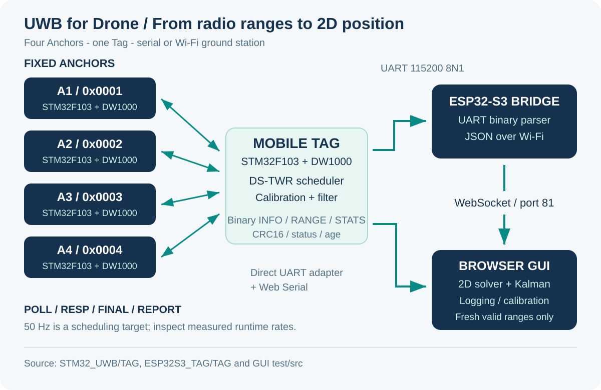

# UWB for Drone

An indoor UWB ranging and visualization project using STM32F103 + DW1000 nodes, an optional ESP32-S3 serial-to-Wi-Fi bridge, and a React ground station. The Tag polls four Anchors; the browser estimates 2D position from valid ranges.

[English](#english) | [Tiếng Việt](#tieng-viet) | [Project overview](PROJECT_OVERVIEW.md)



<a id="english"></a>

## Current capabilities

- DS-TWR ranging using POLL / RESP / FINAL / REPORT, with an SS fallback path.
- Four addressed Anchors, IRQ-driven state machines, timeouts and cycle diagnostics.
- Per-anchor calibration, validity flags, measurement age and first-path-power diagnostics.
- Range filtering, experimental shadow filters and offline replay comparison.
- Binary UART telemetry with CRC, or an explicit ASCII bring-up mode.
- Direct serial or ESP32-S3 WebSocket connection to the ground station.
- Dashboard, 2D position map, Filter Lab, System Health, logging and Calibration tabs.

The nominal 20 ms scheduler targets 50 cycles/s; actual cycle and successful-operation rates are reported at runtime. The ESP32 bridge also caps range broadcasts at one per 20 ms. Neither timing constant guarantees sustained hardware performance.

Accuracy figures in historical project notes are goals or session context. This README does not claim a verified position accuracy, NLOS performance, RF range or flight-ready integration.

## Repository map

| Path | Purpose |
| --- | --- |
| [STM32_UWB/TAG](STM32_UWB/TAG/) | Mobile Tag firmware and telemetry |
| [STM32_UWB/Anchor](STM32_UWB/Anchor/) | Anchor A1, address `0x0001` |
| [STM32_UWB/Anchor_2](STM32_UWB/Anchor_2/), [Anchor_3](STM32_UWB/Anchor_3/), [Anchor_4](STM32_UWB/Anchor_4/) | A2 through A4 |
| [STM32_UWB/Test_hardware](STM32_UWB/Test_hardware/) | Separate radio bring-up project |
| [STM32_UWB/HostTests](STM32_UWB/HostTests/) | C tests for range/adaptive filtering |
| [ESP32S3_TAG/TAG](ESP32S3_TAG/TAG/) | Arduino bridge, UART parser, JSON WebSocket and Wi-Fi manager |
| [GUI test](GUI%20test/) | React 18, TypeScript, Vite 5 application and tests |
| [tools](tools/) | Python calibration and FPP analysis helpers |
| [DW1000_decadriver](DW1000_decadriver/) | DecaWave bare-metal and FreeRTOS reference drivers |
| [PROJECT_OVERVIEW.md](PROJECT_OVERVIEW.md) | Historical architecture and development context |

Active STM32 projects contain their own `dw1000_hw`, ranging and calibration files. Shared changes must be reviewed across role copies. Follow source definitions where older prose or comments differ.

## Hardware and current settings

A full bench setup uses one Tag and four fixed Anchors, each with STM32F103-class hardware and a DW1000 radio, plus a SWD programmer. Choose either a USB-to-UART adapter for the Tag or an ESP32-S3 bridge.

The actual mapping comes from [dw1000_hw.h](STM32_UWB/TAG/Core/Inc/dw1000_hw.h):

| Function | STM32 pin | Connection |
| --- | --- | --- |
| SPI1 CS / SCK / MISO / MOSI | PA4 / PA5 / PA6 / PA7 | DW1000 SPI |
| Radio reset | PA2 | RSTN, driven low then released |
| Radio interrupt | PA3 | IRQ, rising-edge EXTI |
| EXTON / WAKE | PA1 / PB0 | Additional control signals configured as inputs |
| Status LED | PC13 | Active-low board LED |
| USART1 TX / RX | PA9 / PA10 | Adapter or bridge UART |

Bridge defaults in [TAG.ino](ESP32S3_TAG/TAG/TAG.ino):

| Bridge function | Default |
| --- | --- |
| UART RX | GPIO1, connected to STM32 PA9 |
| UART TX | GPIO2, reverse path reserved for future commands |
| LED | GPIO33 |
| STM32 and bridge serial | 115200 baud, 8N1 |
| Wi-Fi | SSID/password placeholders to configure locally |
| WebSocket | `ws://<bridge-ip>:81` |

Use common ground and compatible logic levels. Check breakout power inputs and ESP32-S3 board pin availability before wiring. Direct serial means a suitable UART adapter; the STM32 application does not implement USB CDC.

| Setting | Current source |
| --- | --- |
| STM32 clock | HSI-derived PLL, 64 MHz |
| PHY | Channel 5, PRF16, preamble 256, PAC16, code 4, standard SFD, 6.8 Mbps |
| SPI | 2 MHz initialization; tries 16 MHz runtime, then 8 / 2 MHz on device-ID readback failure |
| Tag / PAN | `0x0000` / `0xDECA` |
| Anchor count | 4, identified as A1 through A4 |
| Binary telemetry | `TELEM_ASCII = 0` |
| Ranging mode | `UWB_USE_DS_TWR = 1` |
| Range filter | Legacy Kalman baseline |
| Adaptive Legacy / C9.2 motion | SHADOW / OFF |

These are defaults in the checked-in source; build overrides can change them. INFO telemetry identifies the active profile.

## Bring up the software

### STM32 nodes

1. Clone the repository:
   ```bash
   git clone https://github.com/TuanLinh05/UWB-For-Drone.git
   cd UWB-For-Drone
   ```
2. Import the needed projects under `STM32_UWB/` into STM32CubeIDE as existing projects.
3. Confirm the MCU, clock, wiring, role address and radio profile before building.
4. Use `Test_hardware` for initial communication checks, then build the Tag and the required Anchor projects.
5. Program each board through the matching SWD configuration. Label physical Anchors A1 through A4.
6. Begin with stationary nodes and line of sight; inspect device-ID, PHY mismatch and timeout counters.

The Tag exposes `device_id`, `dw1000_config_mismatch` and `dw1000_spi_mhz` in the debugger. Initialization failure sets `device_id = 0xDEAD` and enters an LED loop.

### Optional ESP32-S3 bridge

Open `ESP32S3_TAG/TAG/TAG.ino` in the Arduino IDE with the Espressif ESP32 board package. Install **ArduinoJson** by Benoit Blanchon and **WebSockets** by Markus Sattler, as required by the sketch.

Set Wi-Fi credentials locally, confirm GPIO1/GPIO2 and LED wiring, then build for your ESP32-S3 board. The bridge uses a 2048-byte UART RX buffer and expects the STM32's binary mode. Read its assigned IP from USB serial at 115200 baud.

The reverse UART connection is not an implemented configuration or flight-control channel.

### Web ground station

Install Node.js and npm compatible with the committed toolchain, then:

```bash
cd "GUI test"
npm ci
npm run dev
```

Open the URL Vite prints. On Windows, [start_gui.bat](start_gui.bat) enters the GUI folder, installs dependencies if `node_modules` is absent, and runs the development server.

In **Connect**, select the serial device for a direct UART link, or enter the bridge IP for Wi-Fi. Web Serial requires browser support and HTTPS or localhost; the application directs users to Chrome or Edge.

In **Position**, enter and save measured Anchor X/Y coordinates in **metres**. At least three fresh, valid, non-degenerate observations are needed for the 2D solver. Actual UWB ranges are spatial distances, so height differences matter when applying a planar model.

The UI's connected state and data freshness are distinct. Review stale, missing-calibration and excluded-anchor indicators before interpreting a plotted point.

## Telemetry contract

The authoritative definitions are [telemetry.h](STM32_UWB/TAG/Core/Inc/telemetry.h), [telemetry.c](STM32_UWB/TAG/Core/Src/telemetry.c) and the [browser parser](GUI%20test/src/lib/telemetryBinary.ts).

```text
AA 55 | VER u8 | TYPE u8 | LEN u16 | SEQ u32 | TIME_MS u32
      | PAYLOAD[LEN] | CRC16 u16
```

Multi-byte values are little-endian. Version is 1. CRC16 uses polynomial `0x1021`, initial value `0xFFFF`, and covers VER through the end of PAYLOAD, excluding the start marker and CRC.

| TYPE | Payload / timing |
| --- | --- |
| `0x00` INFO | Active calibration/ranging/filter/PHY profile; boot and about once per second |
| `0x01` RANGE | One record per Anchor after each completed cycle |
| `0x02` STATS | Poll/response/error/overrun/UART counters plus measured rates, about once per second |

A RANGE payload starts with `num_rec`, followed by 16-byte records:

```text
anchor_id u16, valid u8, status u8, age_ms u16,
raw_mm i32, filtered_mm i32, fpp_cdbm i16
```

Range units are millimetres; FPP is centi-dBm (`value / 100` gives dBm). Normal `raw_mm` is after software offset. Missing-calibration diagnostics retain pre-offset raw values with `valid = 0`; held filtered values must not be treated as current measurements.

Status bits include timeout `0x01`, RX error `0x02`, bad frame `0x04`, compute error `0x08`, SS fallback `0x10`, missing calibration `0x20`, conditioner reject `0x40` and reacquire `0x80`.

The bridge emits compact JSON messages with `t: "r"`, `"s"` or `"i"`. It carries source and WebSocket sequence information for transport diagnostics. Read [ws_bridge.cpp](ESP32S3_TAG/TAG/ws_bridge.cpp) for the full schema.

Setting `TELEM_ASCII = 1` enables text bring-up output, including `R2` range records with status. Restore binary mode before using the current bridge or browser binary serial parser.

## Calibration and filter experiments

Calibration definitions live in [uwb_calibration.h](STM32_UWB/TAG/Core/Inc/uwb_calibration.h). The default uses software offsets with hardware antenna-delay compensation disabled. Existing DS offset values and masks record a prior A1-A4 session; they are not universal constants for new hardware.

For fresh DS calibration:

1. Hold radio/firmware/filter profiles fixed and measure several known separations per physical Anchor.
2. On the bench, clear the corresponding DS calibrated bit while collecting that Anchor's **missing-calibration diagnostics**. These are pre-offset values.
3. Use the GUI Calibration tab to capture multiple distances and export the data.
4. Review the suggested `UWB_DS_OFFSET_Ax_M` replacement: offset metres = mean pre-offset metres minus true metres.
5. Rebuild with the reviewed offset; validate against independent captures before enabling that Anchor's calibrated bit.
6. Repeat for every Anchor and retain the profile and capture provenance.

Valid range records are already offset-corrected. Do not interpret an offset derived from those records as the full DS replacement value. DS fallback samples belong to the SS profile and must be kept out of a DS fit.

The GUI includes held-out static-bias analysis with a 50 mm target. That target is an acceptance criterion for captured static conditions, not a measured flight-accuracy guarantee.

Legacy Adaptive defaults to SHADOW: candidate state is separate from published range output. C9.2 motion defaults to OFF. Change one experiment at a time and compare recorded baseline/candidate behavior before enabling an ACTIVE mode.

The Python helpers are historical: `calibration_from_log.py` and `analyze_fpp_bias.py` parse older three-Anchor `R,` records rather than current `R2` output. `calibration_from_wizard_csv.py` accepts positional CSV paths and defaults to three Anchors; use `--max-anchor-id 4` when analyzing four-Anchor exports, and review whether values are pre-offset before applying its result.

## Validation and replay tools

The repository provides tests; this documentation update does not establish that they pass on a particular workstation.

```bash
cd "GUI test"
npm run build
npm test
npm run test:core
npm run replay:report -- uwb_log.csv --out report.json
```

Host C test sources are in `STM32_UWB/HostTests/`. Some GUI host-test scripts require a C compiler. Replay reports compare recorded ranges and experimental filters/position variants; they do not certify a hardware system.

Onboard 3D position telemetry and MAVLink/PX4/ArduPilot integration remain future work. The implemented browser solver is 2D.

<a id="tieng-viet"></a>

## Hướng dẫn tiếng Việt

### Hệ thống hiện tại

Tag STM32F103 + DW1000 đo lần lượt bốn Anchor bằng DS-TWR. Dữ liệu đi qua UART nhị phân tới browser trực tiếp hoặc qua cầu nối ESP32-S3. GUI hiển thị khoảng cách, vị trí 2D, sức khỏe hệ thống, log và hiệu chuẩn.

Chu kỳ đặt 20 ms là mục tiêu 50 Hz, không đảm bảo tốc độ đo thực tế. Đọc `cyc_hz`, `ops_hz`, timeout và overrun khi chạy. Repo chưa chứng minh độ chính xác hay khả năng điều khiển bay trên phần cứng của bạn.

### Nối dây và chạy thử

1. SPI: PA4 CS, PA5 SCK, PA6 MISO, PA7 MOSI. **RSTN PA2, IRQ PA3**; EXTON PA1, WAKE PB0.
2. UART Tag PA9 TX nối RX adapter hoặc GPIO1 ESP32-S3; dùng GND chung và mức logic phù hợp.
3. Import project STM32CubeIDE, kiểm tra role A1-A4, profile radio và build trước khi nạp.
4. Clock hiện tại là **64 MHz** từ HSI PLL; SPI khởi tạo 2 MHz rồi thử tốc độ cao với fallback.
5. Nếu dùng bridge, cài thư viện ArduinoJson/WebSockets, cấu hình Wi-Fi và đúng chân board.
6. Trong `GUI test`, chạy `npm ci`, `npm run dev`, mở URL Vite.
7. Connect serial 115200 hoặc IP bridge cổng 81. Nhập tọa độ X/Y Anchor theo **mét** trong Position.

Serial trực tiếp cần USB-UART phù hợp; firmware STM32 hiện không cung cấp USB CDC.

### Hiệu chuẩn và đọc dữ liệu

- Khoảng cách telemetry dùng **mm**, FPP dùng centi-dBm.
- `valid = 0` và dữ liệu giữ lại không phải phép đo hiện tại.
- Offset DS có sẵn là kết quả phiên cũ. Khi hiệu chuẩn mới, thu dữ liệu **trước offset** qua trạng thái missing calibration của Anchor cần đo.
- Offset cần trừ = trung bình khoảng cách trước bù trừ đi khoảng cách thật. Kiểm chứng nhiều cự ly trước khi bật bit calibrated.
- Không lấy dữ liệu SS fallback để fit DS. Raw hợp lệ bình thường đã được trừ offset.
- Adaptive Legacy đang SHADOW, C9.2 đang OFF. Đánh giá log/replay trước khi dùng ACTIVE.
- Các script Python log cũ dùng schema ba Anchor; không đưa trực tiếp `R2` hiện tại vào chúng.
- Vị trí hiện tại là 2D; cần tính đến chênh lệch độ cao khi dùng khoảng cách không gian. MAVLink và tích hợp autopilot chưa được triển khai.

## Credits

Project by [Vu Tuan Linh](https://github.com/TuanLinh05), HCMUT. Bundled reference drivers retain DecaWave Ltd. notices; STM32 HAL/CMSIS retain their component licenses. The ESP32 bridge uses ArduinoJson by Benoit Blanchon and WebSockets by Markus Sattler.

Related work: [DW1000_DISTANCE](https://github.com/TuanLinh05/DW1000_DISTANCE) and [DWM1001_UWB](https://github.com/TuanLinh05/DWM1001_UWB).
